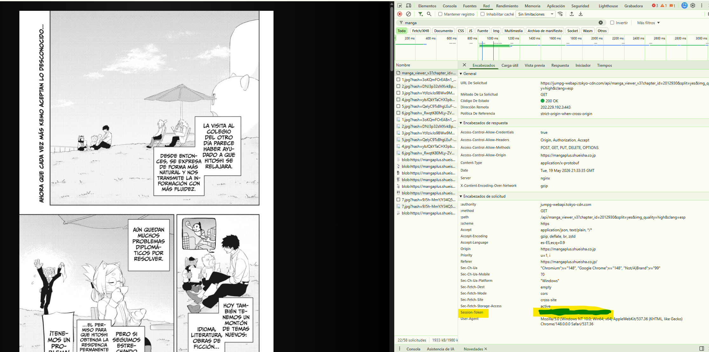

# Mangaplus Downloader

> **Fork** of [hurlenko/mloader](https://github.com/hurlenko/mloader) with support for authenticated session tokens.

[](https://github.com/hurlenko/mloader/releases/latest)


## **mloader** - download manga from mangaplus.shueisha.co.jp

## 🚩 Table of Contents

- [Installation](#-installation)
- [Usage](#-usage)
- [Authentication](#-authentication)
- [Command line interface](#%EF%B8%8F-command-line-interface)

## 💾 Installation

The recommended installation method is using `pip`:

```bash
pip install git+https://github.com/masioware/mloader.git
```

After installation, the `mloader` command will be available. Check the [command line](%EF%B8%8F-command-line-interface) section for supported commands.

## 📙 Usage

Copy the url of the chapter or title you want to download and pass it to `mloader`.

You can use `--title` and `--chapter` command line argument to download by title and chapter id.

You can download individual chapters or full title (but only available chapters).

Chapters can be saved as `CBZ` archives (default) or separate images by passing the `--raw` parameter.

## 🔑 Authentication

Some chapters require a MangaPlus account to access. You can pass your session token via the `--token` flag or the `MLOADER_TOKEN` environment variable:

```bash
mloader --token YOUR_SESSION_TOKEN https://mangaplus.shueisha.co.jp/viewer/...
```

```bash
export MLOADER_TOKEN=YOUR_SESSION_TOKEN
mloader https://mangaplus.shueisha.co.jp/viewer/...
```

To obtain your session token, log in to MangaPlus in a browser and inspect the requests — look for the `Session-Token` header in API calls.



## 🖥️ Command line interface

Currently `mloader` supports these commands

```
Usage: mloader [OPTIONS] [URLS]...

  Command-line tool to download manga from mangaplus

Options:
  --version                       Show the version and exit.
  -o, --out <directory>           Save directory (not a file)  [default:
                                  mloader_downloads]
  -r, --raw                       Save raw images  [default: False]
  -q, --quality [super_high|high|low]
                                  Image quality  [default: super_high]
  -s, --split                     Split combined images  [default: False]
  -c, --chapter INTEGER           Chapter id
  -t, --title INTEGER             Title id
  -b, --begin INTEGER RANGE       Minimal chapter to try to download
                                  [default: 0;x>=0]
  -e, --end INTEGER RANGE         Maximal chapter to try to download  [x>=1]
  -l, --last                      Download only the last chapter for title
                                  [default: False]
  --chapter-title                 Include chapter titles in filenames
                                  [default: False]
  --chapter-subdir                Save raw images in sub directory by chapter
                                  [default: False]
  -k, --token TEXT                Session token for authenticated requests
                                  [$MLOADER_TOKEN]
  --help                          Show this message and exit.
```